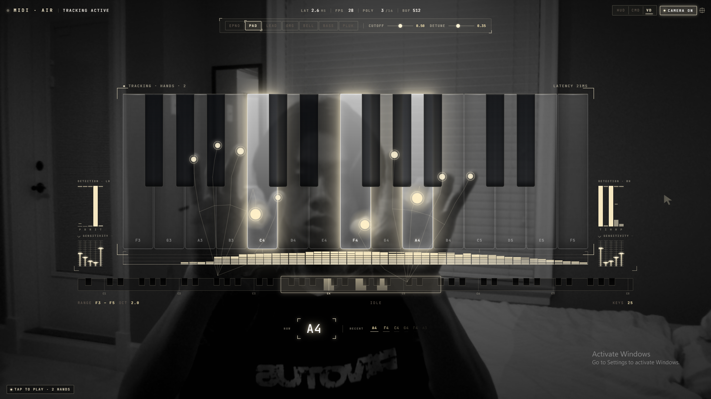

# midi-air

**Gesture-controlled synthesizer — play piano with your bare hands in the browser.**

**[→ Live Demo](https://richardwu150.github.io/midi-air/)**



---

## What it is

Point your fingers at an on-screen keyboard. Press down. Sound plays. No install, no MIDI controller, no plugins — just a webcam and a browser.

The camera sees your hands. A real-time computer vision pipeline detects when each fingertip presses toward a key and triggers a WebAudio synthesizer. The keyboard spans the full 88-key range and can be panned and zoomed by gesture.

---

## How the press detection works

The core problem: how do you detect a keypress from a 2D camera?

Z-depth estimation from a single RGB camera is too noisy to be useful — small head movements corrupt the signal. The approach that works is **foreshortening**: as a finger bends toward the camera, the apparent distance between the fingertip and its MCP joint shrinks relative to hand scale.

```
handScale = dist(wrist, middle-MCP)
fs        = dist(fingertip, fingertip-MCP) / handScale
fsDrop    = (baseline − fs) / baseline
```

Each finger maintains a per-finger EMA baseline that tracks its resting foreshortening. A press fires when `fsDrop` crosses a configurable threshold. The baseline uses a pure EMA (`0.92 × baseline + 0.08 × fs`) with no floor — a Math.max floor causes the baseline to ratchet up on spikes and freeze, producing stuck notes.

Two false-trigger guards run on every frame:

- **Sympathetic suppression** — if two adjacent fingers cross threshold simultaneously, the weaker one is suppressed (natural hand mechanics cause fingers to move together)
- **Mass-trigger guard** — if 4+ fingers would fire in the same frame, all are suppressed

MIDI note assignment is locked at press onset, not at threshold crossing — this prevents X-axis drift during the press motion from firing the wrong key.

---

## Features

- **7 synthesizer voices** — electric piano, pad, lead, organ, bell, bass, pluck — all built from WebAudio oscillators with gain envelopes and a shared delay/feedback bus
- **Full 88-key range** — pan with two fingers, zoom with thumb + index; range persists across sessions
- **Per-finger sensitivity** — 10 independent sliders (5 per hand), tuned to account for each finger's natural range of motion
- **Real-time detection visualization** — segmented LED meters show live foreshortening signal, peak hold, and threshold per finger
- **Spectrum analyzer** — log-frequency, 56-bar display with peak hold and reflection
- **3 color themes** — HUD (cyan), CMD (amber), Void (mono)
- **Zero install** — no build step, no dependencies to install; runs from a single HTML file via CDN

---

## Stack

| Layer | Technology |
|---|---|
| UI | React 18 (CDN), Babel standalone (in-browser JSX) |
| Hand tracking | MediaPipe Tasks Vision — HandLandmarker |
| Synthesizer | WebAudio API — oscillators, filters, gain envelopes, delay bus |
| Overlay | HTML Canvas 2D — skeleton, trails, fingertip halos |
| Persistence | localStorage — range and per-finger sensitivity |
| Hosting | GitHub Pages |

---

## Browser support

Chrome or Edge recommended. Requires camera permission and a GPU-capable browser for MediaPipe's WebGL delegate. Firefox has limited WebAudio compatibility.
